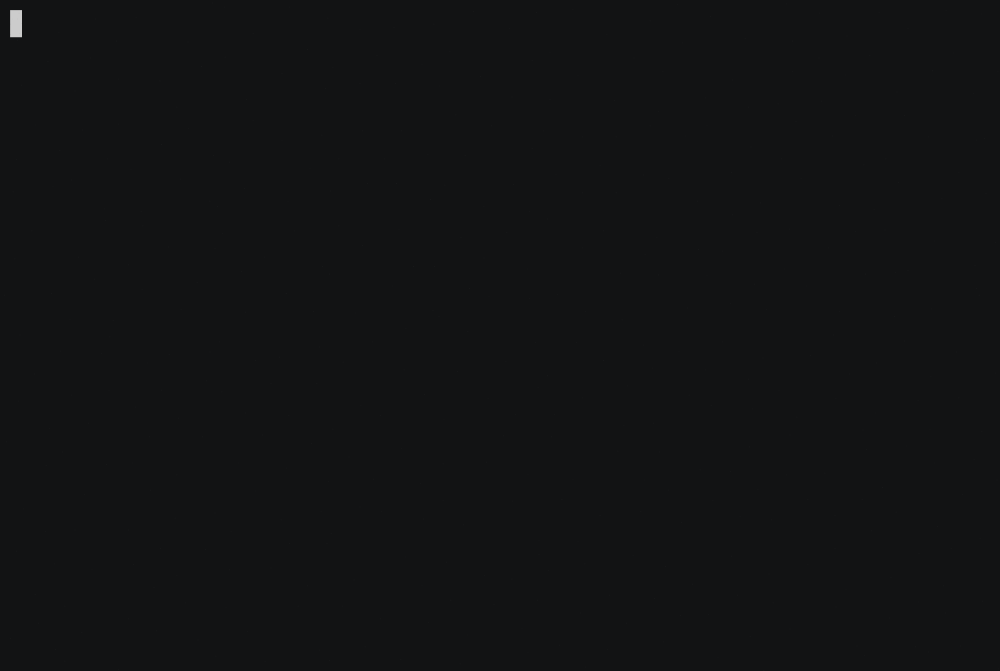

mongoquine
==========

**A MongoDB Aggregation that outputs itself.**

    > var cmd = JSON.parse(cat("mongoquine.json"))
    > bsonWoCompare(cmd, db.runCommand(cmd).cursor.firstBatch[0])
    0

[`mongoquine.json`](mongoquine.json) contains the aggregation itself, in command form (ie. parse as JSON and then use `db.runCommand()`).  There should be a single document in the `quine` collection (can have any contents).  The aggregation will return a single document, which can be accessed via the `cursor.firstBatch[0]` field of the command return.  This returned document will be identical to the command document that was sent via `runCommand()`.

[`quine-tester.js`](quine-tester.js) contains a `mongo` shell test runner to see if a given file is such a quine.  It uses (ie. drops) the `quine` db.  Run it as:

    mongo --host ... --port ... --eval 'filename = "mongoquine.json"' quine-tester.js

Requires MongoDB 3.4.4 or higher.  My understanding is that due to the way [`$literal`](https://docs.mongodb.com/manual/reference/operator/aggregation/literal/) works, it's not possible to use this approach without [`$arrayToObject`](https://docs.mongodb.com/manual/reference/operator/aggregation/arrayToObject/) (which was [introduced in version 3.6](https://docs.mongodb.com/manual/release-notes/3.6/#new-aggregation-operators) and [backported to 3.4.4](https://docs.mongodb.com/manual/release-notes/3.4/#apr-21-2017)).  (Other approaches might be possible; I haven't tried.)

